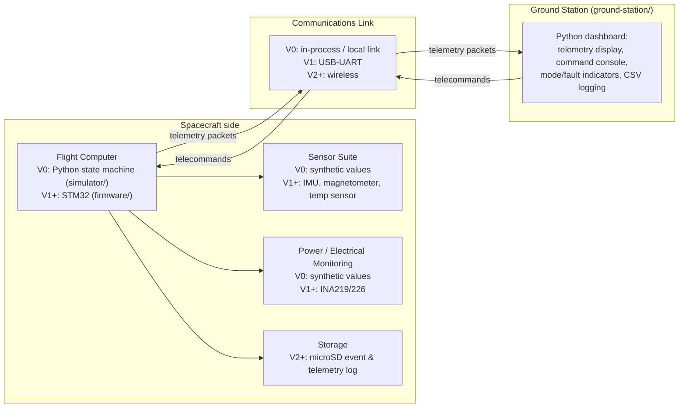

# Top-Level Block Diagram

**Status:** V0 draft. Boxes marked "V0" are real in the current phase; boxes marked
"V1+"/"V2+" are planned and not yet implemented — see the version roadmap in the
root README.

## Diagram

## Notes

- **Flight Computer** owns the BOOT/NOMINAL/SAFE/TEST mode state machine and FDIR
  logic (fault detection against `docs/requirements/SRS.md` FDIR-002 through
  FDIR-007). In V0 this is a Python process standing in for firmware; the mode logic
  and packet formats it implements are the same ones V1 firmware must conform to —
  see `docs/interfaces/` (telemetry and command dictionaries, not yet written).
- **Sensor Suite** and **Power/Electrical Monitoring** are synthetic data generators
  in V0 (randomized/simulated within realistic ranges). They get replaced by real
  I2C/SPI sensor reads in V1 without the Flight Computer's packet format or mode
  logic needing to change — that's the point of defining the protocol in V0 first.
- **Storage** (microSD logging) doesn't exist yet even in the plan for V0; it's V2
  scope per the roadmap, included here only to show where it attaches architecturally.
- **Communications Link** is the one box V0 fakes most heavily: telemetry and
  commands go directly between two Python processes (or even two objects in the same
  process, to start) rather than over any real wire. It's still drawn as its own box
  because the packet framing has to behave as if it *were* a real link — sequence
  numbers, integrity checks — so nothing about the protocol needs to change when a
  real UART or radio link is substituted in.
- **Ground Station** is the one component that's "real" starting in V0 — no
  simulation stand-in, it's the actual application described in `GS-001` through
  `GS-005`.
