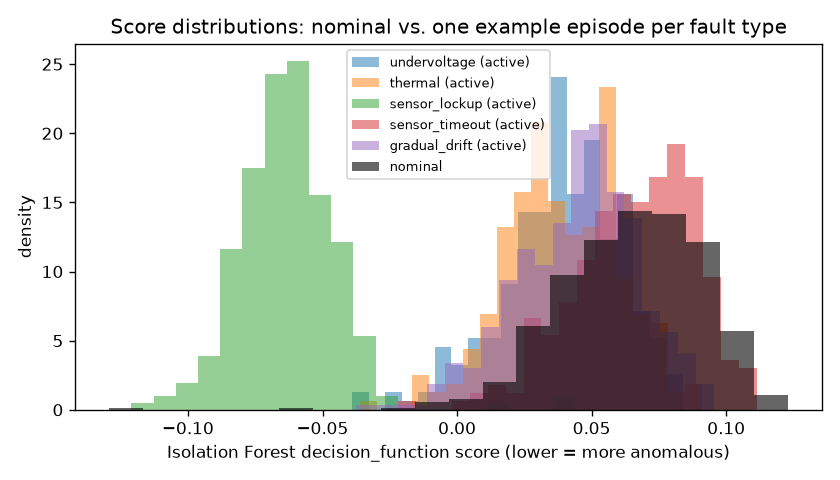

# ML Anomaly Detection -- Evaluation Report

**Status: Simulated + Trained.** Every number below comes from this synthetic simulator and this specific trained model. Nothing here has been run against real hardware or real sensor data, and none of it should be read as a claim about real-world detection performance.

Model: `ml\models\isolation_forest_v1.joblib` -- Isolation Forest, 50 trees, trained on 24000 nominal samples (seed 0). Evaluated on a held-out dataset generated with seed 1 -- disjoint episodes, never seen during training.

## Per-fault-type detection: FDIR (deterministic) vs. ML (Isolation Forest)

No single blended "accuracy" number is reported here on purpose -- it would hide exactly the differences that matter. FDIR "detection" means the fault's mapped `FaultFlag` bit latched (not necessarily that SAFE mode was entered -- `sensor_timeout` and `gradual_drift` are flag-only by design, see `fdir/engine.py`'s `SAFE_MODE_TRIGGER_FLAGS`). ML "detection" means `IsolationForest.predict() == -1` (sklearn's own contamination-derived threshold, not a hand-picked cutoff).

| Fault type | Episodes | FDIR recall | FDIR mean latency (s) | ML episode recall | ML mean latency (s) | ML per-sample flag rate | vs. nominal |
|---|---|---|---|---|---|---|---|
| undervoltage | 15 | 1.00 | 0.20 | 1.00 | 1.82 | 3.5% | 3.7x |
| thermal | 15 | 1.00 | 0.30 | 1.00 | 2.57 | 3.8% | 4.0x |
| sensor_lockup | 15 | 1.00 | 0.50 | 1.00 | 0.45 | 86.8% | 91.4x |
| sensor_timeout | 15 | 1.00 | 0.20 | 0.80 | 10.41 | 0.8% | 0.9x |
| gradual_drift | 15 | 0.00 | n/a | 1.00 | 5.69 | 3.4% | 3.6x |

### Read the last two columns, not the recall column

**ML episode recall is the misleading number here, and it is reported only because it would be conspicuous to omit.** "Episode recall" asks *did at least one sample anywhere in this episode get flagged* -- and with ~250 fault-active samples per episode against a threshold that flags 0.9% of in-distribution samples by construction, that question answers itself affirmatively by chance alone, whether or not the model can actually discriminate the fault. This is the exact same episode-length artifact documented for false positives below; it inflates recall and false-alarm rate identically, and an earlier draft of this report applied that reasoning to only one of the two.

The **per-sample flag rate against the nominal baseline** (last two columns) is the honest measure of discriminative power. On that measure:

- `undervoltage` (3.7x baseline): weak but real signal -- elevated over baseline, though the score distributions overlap nominal substantially.
- `thermal` (4.0x baseline): weak but real signal -- elevated over baseline, though the score distributions overlap nominal substantially.
- `sensor_lockup` (91.4x baseline): **strongly detected** -- unambiguous, orders of magnitude above baseline.
- `sensor_timeout` (0.9x baseline): **no discriminative power** -- flagged at or below the nominal false-alarm rate. Any episode-level "recall" for this fault is chance, not detection.
- `gradual_drift` (3.6x baseline): weak but real signal -- elevated over baseline, though the score distributions overlap nominal substantially.

## What the ML layer actually adds

**The one unambiguous win is `sensor_lockup`** (91x the nominal flag rate, 87% of fault samples flagged). A frozen IMU drives every rolling-standard-deviation feature to exactly zero across six channels simultaneously -- a region of feature space with no nominal training data anywhere near it, which is precisely the situation an isolation-based method handles well. The score distribution for this fault is cleanly separated from nominal (see the plot below); it is the only fault type for which that is true.

**`gradual_drift` is a weaker, more qualified result than an earlier draft of this report claimed.** FDIR's adaptive baseline (`FDIR-006`, an EWMA over `bus_voltage_v`) recalled **0%** of drift episodes -- a genuine, structural blind spot, and not a bug: an online-adaptive statistic continuously updates its notion of "normal" toward the current signal, so a drift slow enough that no single sample-to-sample step exceeds the deviation threshold simply gets absorbed as the new normal. A model trained once on a fixed reference and never updated does not have that blind spot, and the numbers do show the Isolation Forest flagging drift samples at 3.6x the nominal rate -- real, consistent signal in the right direction.

**And `sensor_timeout` is a structural blind spot for the model, for a reason worth understanding rather than patching over.** The only signature of this fault is the `imu_responded` flag going false; the environment still emits plausible-looking IMU values (that is what distinguishes a timeout from a lockup). But `imu_responded` is *constant at 1.0 throughout the nominal-only training set* -- zero variance -- so no tree ever splits on it: a direct count over the trained model finds **0 splits on that feature out of 3089 internal nodes across all 50 trees.** Flipping it to 0.0 at inference therefore changes no traversal path whatsoever, and the model is not merely bad at this fault but blind to it by construction.

The general lesson, which applies well beyond this one fault: **any feature that is constant in nominal-only training data is invisible to an isolation-based detector, no matter how diagnostic it would be at inference time.** Training on normal data alone means the model can only learn to be surprised along axes that actually varied during training. This is not a tuning problem and more trees will not fix it.

This is also a concrete argument *for* the hybrid architecture rather than against it. The deterministic layer catches `sensor_timeout` at 100% recall in 0.20 s, because a response/no-response check needs no training distribution at all -- and the ML layer catches `sensor_lockup`, where a frozen-but-responding sensor produces perfectly in-range values that no fixed threshold would object to. The two layers have genuinely complementary blind spots, which is measured here, not assumed.

But that is a **weak** separation, not a solved detection problem. At 3.4% of drift samples flagged, the score distributions overlap nominal heavily, and the 100% *episode* recall figure is largely the episode-length artifact described above rather than reliable per-sample detection. The correct reading is: **this measurement supports the direction of `FDIR-007`'s argument -- a trained model sees something the adaptive baseline structurally cannot -- without yet demonstrating a detector good enough to depend on for drift.** Whether that gap closes with better features (an explicit long-window trend feature would target drift directly), a different algorithm, or real rather than synthetic data is an open question, and deliberately not answered here.

## False positive rate (nominal episodes only)

Measured on 40 held-out nominal episodes (0.67 simulated hours total, 40 episodes x 600 samples/episode).

| Detector | Episodes with >=1 false alarm | False alarms/hour (episode-level) | False-flagged samples (row-level) |
|---|---|---|---|
| FDIR (any fault flag) | 0.00% | 0.000 | 0.000% |
| ML (Isolation Forest) | 100.00% | 60.100 | 0.950% |

**Read the row-level column, not just the episode-level one, for ML:** with `contamination=0.01`, sklearn's `predict()` is constructed to flag roughly that fraction of in-distribution samples by definition. At 600 samples/episode, essentially any nonzero per-row rate makes the *episode*-level "had at least one false alarm" rate approach 100% -- that's an artifact of episode length, not evidence the detector is unusable. The row-level rate is the number that should be compared to the `contamination=0.01` setting.

**Important distinction:** `FDIR-008` (see `docs/requirements/SRS.md`) targets <=1 false *SAFE-mode entry* per 6h. The ML false-alarm rate above is a different, broader measure (any `ML_ANOMALY` flag latch) -- `ML_ANOMALY` can never force SAFE mode by itself (see `fdir/engine.py`'s `SAFE_MODE_TRIGGER_FLAGS`), so this table is not a measurement of FDIR-008 and should not be read as one.

## What the anomaly score is -- and is not

The Isolation Forest score is the model's mean normalized path length across its trees (shorter average path to isolate a point = more anomalous; sklearn's `decision_function` reports this so that lower values mean more anomalous). **This is not a probability.** It is not calibrated against any real frequency of fault occurrence, and nothing in this codebase presents it as one. The binary anomalous/normal calls in the table above come from sklearn's own `predict()`, which thresholds this score using the `contamination=0.01` value chosen at training time -- an explicit hyperparameter, not a discovered probability cutoff.

## Computational / memory requirements

50 trees, average 125 nodes/tree (6228 total nodes). Exported to C (`ml/export_embedded.py` -> `firmware/inc/anomaly_model.h`) as flat arrays of (feature index, threshold, left child, right child) per node -- roughly 97 KB as plain arrays before any packing/compression, well within a typical STM32F4's flash budget. Inference is pure integer/float comparison tree traversal -- at most 50 traversals of depth ~log2(256) each per sample, no floating-point matrix multiplication and no neural-network runtime dependency. This is the reason Isolation Forest was chosen over a neural network for Phase 1 -- see `docs/architecture/phase0-1-engineering-decisions.md`, decision 4.

## Limitations of synthetic data

- Sensor noise is modeled as independent Gaussian per channel; real sensor noise (temperature-dependent, correlated across axes, occasionally non-Gaussian) is not represented.
- No radiation, EMI, or thermal-cycling effects are modeled at all.
- Fault signatures (step changes, linear ramps, frozen values, non-response) are simplified models of real failure modes, not measurements of how this project's actual hardware fails.
- All thresholds and debounce windows (`fdir/config.py`) are unvalidated design targets, not characterized from real hardware timing.
- Every number above comes from one simulated environment with a fixed noise model; it may not generalize to a differently-tuned simulator, let alone to real hardware.
- Training and held-out data were generated by the same environment code with different seeds, not by independently-modeled processes -- this is a weaker form of held-out evaluation than genuinely independent data would provide.

