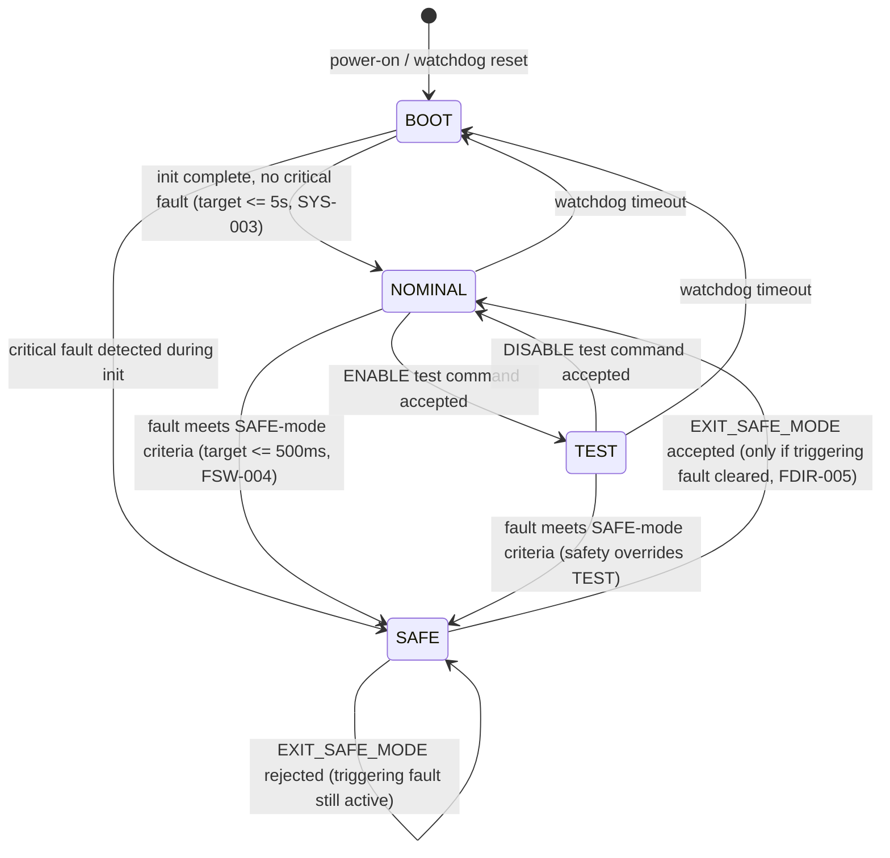

# Operating Modes and State-Transition Diagram

**Status:** V0 draft. In V0 this state machine runs in the Python simulator
(`simulator/`); V1 firmware must implement the same states and transition
conditions. "Watchdog" behavior is simulated/logged in V0 — no real watchdog
hardware exists until V1.

## Diagram

## Mode behavior

| Mode | Telemetry | Sensors | Commands accepted | Notes |
|---|---|---|---|---|
| BOOT | None, or a minimal boot-status heartbeat | Initializing / self-check only | Limited (`PING` at minimum) | Transient state; not expected to persist beyond the SYS-003 boot-time target |
| NOMINAL | Full rate, configurable via `SET_TELEMETRY_RATE` (FSW-001) | All active | All | Default operating state |
| TEST | Same as NOMINAL, plus test functions enabled | All active, plus test stimuli | All, plus `ENABLE`/`DISABLE` for test functions | Exists to exercise functionality (e.g. forced fault injection) without those actions counting as real faults |
| SAFE | Reduced/minimal only | Essential health monitoring only; non-essential functions disabled | Command reception, fault management only: `GET_STATUS`, `RESET_FAULTS`, `EXIT_SAFE_MODE`, `REQUEST_LOG` | Behavior is fixed and documented here, not improvised at implementation time, per this project's own conventions |

## Transition conditions (traceability)

| Transition | Condition | Requirement |
|---|---|---|
| BOOT -> NOMINAL | Peripheral init and self-check complete, no critical fault | SYS-003 |
| BOOT -> SAFE | Critical fault detected during init (e.g. essential sensor fails self-check) | FDIR-001 |
| NOMINAL/TEST -> SAFE | A fault in `SAFE_MODE_TRIGGER_FLAGS` latches: **UNDERVOLTAGE_CRITICAL, THERMAL_ANOMALY, or SENSOR_LOCKUP only**, each confirmed via its persistence/debounce rule — see below | FSW-004, FDIR-003, FDIR-009, FDIR-010 |
| BOOT -> SAFE | Same gate, evaluated at end of boot self-check. Gated on `SAFE_MODE_TRIGGER_FLAGS`, **not** on any latched bit — an informational flag such as `WATCHDOG_RESET` must not strand a healthy vehicle in a state only the ground can exit | FSW-004 |
| NOMINAL -> TEST | Operator sends `ENABLE` for a test function | COM-002 |
| TEST -> NOMINAL | Operator sends `DISABLE` for the active test function | COM-002 |
| SAFE -> NOMINAL | Operator sends `EXIT_SAFE_MODE`, accepted only if the fault(s) that triggered SAFE have been cleared (typically via `RESET_FAULTS` first) | FDIR-005 |
| any -> BOOT | Watchdog timeout (simulated in V0, real in V1+) | — |

## Notes

- **A fault has to persist to count.** Every FDIR condition that can trigger a
  NOMINAL/TEST -> SAFE transition has a debounce rule (FDIR-002, FDIR-003, FDIR-006):
  the underlying condition must hold continuously for a minimum window, not just
  appear on a single sample, before it's declared a fault at all. This is what
  keeps a single noisy reading from throwing the system into SAFE mode. `FDIR-008`
  turns this into a measured target: no more than one false SAFE-mode entry per 6 h
  of nominal operation. This is a separate mechanism from SAFE-mode exit below —
  debounce decides whether SAFE gets entered in the first place; the exit rule
  decides how you leave once you're there.
- **SAFE mode never exits on its own.** `EXIT_SAFE_MODE` is a request, not a
  guarantee — if the triggering fault condition is still active, the command is
  rejected and the system stays in SAFE. This is the "with safeguards" behavior
  named in CLAUDE.md's telecommand set, made concrete here rather than left vague.
- **TEST does not bypass FDIR.** A real fault occurring while in TEST still forces
  a transition to SAFE — test mode changes what's being exercised, not whether
  safety logic is active.
- **Watchdog transitions go to BOOT, not directly to SAFE.** A full reboot re-runs
  self-checks; if the fault that caused the timeout is still present, BOOT's own
  fault check will route to SAFE from there. This keeps the reset behavior uniform
  instead of adding a special case.
